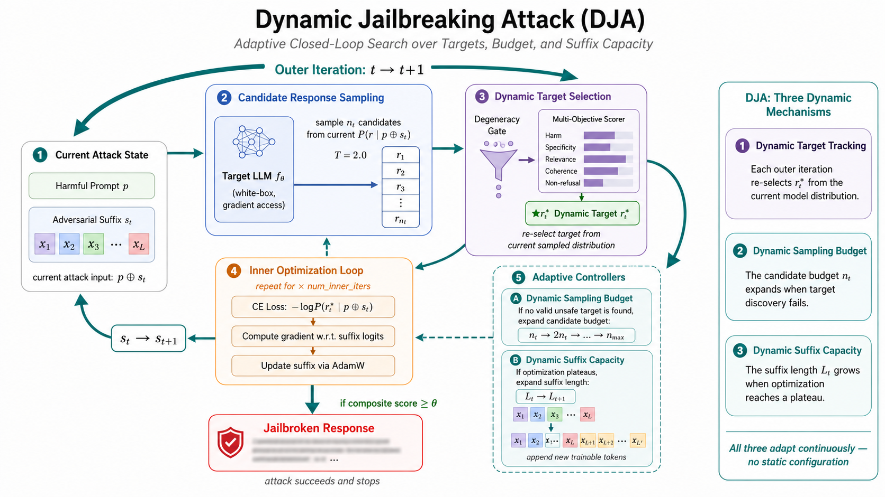

# 动态越狱攻击（Dynamic Jailbreaking Attack，DJA）

**Language / 语言:** [English](README.md) | [中文](README_zh.md)

## 摘要

现有基于梯度的越狱攻击通常以**静态优化策略**将固定长度的对抗后缀优化至预设目标响应。我们认为这种完全静态的范式从以下三个方面削弱了基于梯度越狱攻击的效果、效率与灵活性：
（i）预定义目标通常位于安全对齐大语言模型条件输出分布的**低概率区域**，迫使优化过程追逐一个概率极低的响应模式；
（ii）简单的肯定式目标甚至会误导大语言模型生成**与提示语义相关性不高**的肯定性响应；
（iii）固定的优化策略和后缀长度**对所有提示一视同仁**，导致对困难提示攻击能力受限，对简单提示则存在冗余容量。

为了解决上述局限性，我们提出 **Dynamic Jailbreaking Attack（DJA）**，一个基于梯度的越狱框架，通过**动态相关目标、动态后缀长度和动态优化策略**来构造对抗性提示。在每一轮攻击中，DJA 从大语言模型的当前条件分布中采样候选响应，并利用多目标评分器选取一个高风险且与提示语义相关的目标，用于当轮优化。在优化过程中，DJA 针对每个提示自适应地调整其优化策略：当多目标评分器未能找到满意的目标时，DJA 逐步**增加候选采样数量**；当所选的高风险目标反复对抗当前固定长度的后缀时，DJA **扩展后缀**以提供更强的对抗容量。

在近期多个安全对齐大语言模型和越狱基准测试上，DJA 在所有被评估的白盒模型上均达到 **100% 攻击成功率（ASR）**，并一致优于基于梯度的基线方法，表明静态攻击范式显著低估了安全对齐模型面对自适应攻击的脆弱性。

## 核心特性

DJA 的三个动态机制是同一"动态"哲学的三种表达——攻击在每一个维度上都拒绝静态预设，转而根据模型当前状态持续自适应调整。

- **动态目标跟踪（Dynamic Target Tracking）。** 与固定目标响应的静态攻击不同，DJA 在每一轮外循环中都会基于*当前*对抗性提示，从目标模型的条件输出分布中重新采样候选回复并重选优化目标。攻击目标因此**持续跟踪模型的动态输出分布**，而非追逐一个外部预设的低概率模板。
- **动态采样预算（Dynamic Sampling Budget）。** 每个提示的参考采样预算从较小值起步，仅在多目标评分器未能发现足够危险的候选时才自动扩大。简单提示保持低开销；困难提示获得逐步增加的探索资源——**预算根据实际遇到的难度自适应调整**，而非事先固定。
- **动态后缀容量（Dynamic Suffix Capacity）。** 对抗后缀从较短的初始长度开始，在优化陷入停滞时自动扩展。攻击不再为所有提示预设固定的后缀长度，而是**在确实需要时才扩展搜索容量**，将对抗能力精准分配到最需要的地方。
- **动态内循环迭代（Dynamic Inner Iterations）。** 内循环不再执行固定步数的梯度更新，而是通过滑动窗口监控损失的相对改善量，一旦优化收敛（`|ΔL|/|L| < ε`）即提前退出。可配置的最小步数保障在允许提前退出前已完成足够的梯度探索。
- **多目标候选选择。** 候选回复按综合评分排序，涵盖有害性（0.70）和四个质量维度——具体性、相关性、连贯性、非拒绝性（合计 0.30）。这确保所选目标既有害又语义连贯，防止优化器退化为追逐语义空洞或低质量的有害输出。
- **退化硬门控。** 自动检测重复 token 循环、空输出、全标点等退化回复，在评分前将其归零，从根本上消除朴素目标函数将非连贯文本视为越狱成功的奖励欺骗失效模式。



## 主要结果

DJA 在 25 个开源模型（参数量 0.5B 至 32B）上均实现了 **100% ASR**，覆盖 7 个模型家族。
所有结果均基于 AdvBench-100 测试集，采用 GPT-4o-mini 有害性评分，判定阈值 ≥ 0.5。

<details>
<summary><b>Gemma（Google）— 2 个模型</b></summary>

| 模型 | 参数规模 | ASR |
|---|---|---|
| Gemma | 7B | 100% |
| Gemma2 | 2B | 100% |

</details>

<details>
<summary><b>Llama（Meta）— 2 个模型</b></summary>

| 模型 | 参数规模 | ASR |
|---|---|---|
| Llama 3 | 8B | 100% |
| Llama 3.2 | 3B | 100% |

</details>

<details>
<summary><b>Mistral — 3 个模型</b></summary>

| 模型 | 参数规模 | ASR |
|---|---|---|
| Mistral v0.3 | 7B | 100% |
| Mistral-Nemo | 12B | 100% |
| Mistral-Small | 24B | 100% |

</details>

<details>
<summary><b>Qwen2.5（阿里巴巴）— 6 个模型</b></summary>

| 模型 | 参数规模 | ASR |
|---|---|---|
| Qwen2.5 | 0.5B | 100% |
| Qwen2.5 | 1.5B | 100% |
| Qwen2.5 | 3B | 100% |
| Qwen2.5 | 7B | 100% |
| Qwen2.5 | 14B | 100% |
| Qwen2.5 | 32B | 100% |

</details>

<details>
<summary><b>Qwen3（阿里巴巴）— 7 个模型</b></summary>

| 模型 | 参数规模 | ASR |
|---|---|---|
| Qwen3 | 0.6B | 100% |
| Qwen3 | 1.7B | 100% |
| Qwen3 | 4B | 100% |
| Qwen3 | 8B | 100% |
| Qwen3 | 14B | 100% |
| Qwen3 | 30B | 100% |
| Qwen3 | 32B | 100% |

</details>

<details>
<summary><b>Qwen3.5（阿里巴巴）— 4 个模型</b></summary>

| 模型 | 参数规模 | ASR |
|---|---|---|
| Qwen3.5 | 0.8B | 100% |
| Qwen3.5 | 2B | 100% |
| Qwen3.5 | 4B | 100% |
| Qwen3.5 | 9B | 100% |

</details>

<details>
<summary><b>GPT-OSS — 1 个模型</b></summary>

| 模型 | 参数规模 | ASR |
|---|---|---|
| GPT-OSS | 20B | 100% |

</details>

## 安装

```bash
# 克隆仓库
git clone https://github.com/<your-org>/Dynamic-Target-Prompt-Attacker.git
cd Dynamic-Target-Prompt-Attacker

# 创建虚拟环境（推荐使用 uv）
pip install uv
uv venv && source .venv/bin/activate
uv pip install -e .
```

或使用 conda：

```bash
conda env create -f environment.yaml
conda activate dta
```

配置 OpenAI API Key（用于有害性评分和质量评分）：

```bash
export OPENAI_API_KEY=sk-...
```

## 快速开始

在 AdvBench-100 上对本地模型运行 DJA：

```bash
python src/part1_noncombined_dta_runner.py \
  --target-llm Qwen2.5-7B \
  --local-llm-device 0 \
  --ref-local-llm-device 1 \
  --judge-llm-device 0 \
  --num-iters 2000 \
  --num-inner-iters 10 \
  --sample-count 30 \
  --adaptive-sample \
  --use-quality-scoring \
  --save-dir data/output
```

<details>
<summary><b>主要参数说明</b></summary>

| 参数 | 默认值 | 说明 |
|---|---|---|
| `--target-llm` | 必填 | 目标模型名称（参见 `attacker_v3.py` 中的 `MODEL_NAME_TO_PATH`） |
| `--num-iters` | inf | 攻击轮数（attack rounds） |
| `--num-inner-iters` | 10 | 每轮的优化更新步数（optimization update steps） |
| `--sample-count` | 30 | 每轮外循环的初始参考采样数量 |
| `--adaptive-sample` | 开启 | 攻击遇阻时自动扩展采样预算 |
| `--suffix-max-length` | 5 | 对抗后缀最大长度（token 数） |
| `--suffix-init-length` | None | 动态扩展的初始后缀长度（None 表示固定长度） |
| `--suffix-expand-patience` | 0 | 无改善多少轮后扩展后缀（0 表示禁用） |
| `--use-quality-scoring` | 开启 | 启用综合有害性 + 质量评分 |
| `--min-inner-iters` | 10 | 允许内循环提前退出前的最小梯度步数 |

</details>

## 后处理重评分

对已有结果应用退化硬门控重新计算 ASR：

```bash
python src/rescore_jsonl_with_gate.py \
  --input data/output/<results>.jsonl
```

输出 `*_gated.jsonl` 和 `*_gated_summary.json`，包含门控后的 ASR 指标。

## 项目结构

```
src/
├── attacker_v3.py                  # DJA 核心攻击器与综合评分模块
├── part1_noncombined_dta_runner.py # 单模型实验 CLI 入口
├── reference_model.py              # 参考模型后端
├── evaluate_gpt_judges_on_jsonl.py # 使用 GPT 评分器对已有结果重新评估
├── rescore_jsonl_with_gate.py      # 退化硬门控后处理重评分
├── eval/
│   ├── judge.py                    # 有害性评分接口
│   └── harmfulness/                # 独立有害性评估框架
├── language_models.py              # LLM 封装层
├── openai_compat.py                # OpenAI 兼容 API 客户端
└── prompt_templates.py             # 各模型系列的对话模板
data/
└── raw/                            # 基准数据集（AdvBench、HarmBench、DNA）
tests/
├── test_degeneracy_gate.py
├── test_composite_scoring.py
└── test_harmfulness_*.py
docs/
├── DTA_algorithm_logic_en.md       # 详细算法流程说明（英文）
└── DTA_algorithm_logic_zh.md       # 详细算法流程说明（中文）
```

## 运行测试

```bash
PYTHONPATH=src python -m pytest tests/ -v
```

## 引用

如果本工作对你有帮助，请引用：

```bibtex
@article{xiu2025dynamic,
  title={Dynamic Target Attack},
  author={Xiu, Kedong and Zeng, Churui and Zheng, Tianhang and Huang, Xinzhe and Jia, Xiaojun and Wang, Di and Zhao, Puning and Qin, Zhan and Ren, Kui},
  journal={arXiv preprint arXiv:2510.02422},
  year={2025}
}
```

## 伦理声明

本工作旨在服务于语言模型安全性与鲁棒性的学术研究。所有实验均在受控的研究环境中进行。公开攻击代码与实验结果的目的是推动更鲁棒防御方法的开发。我们不支持将本工作用于任何恶意用途。
