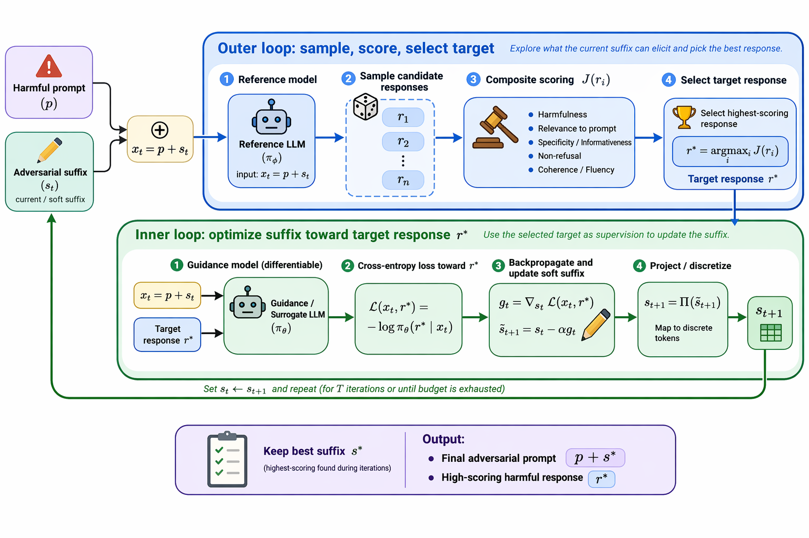

# 动态越狱攻击（Dynamic Jailbreaking Attack，DJA）

**Language / 语言:** [English](README.md) | [中文](README_zh.md)

## 摘要

现有基于梯度的白盒越狱攻击通常采用一种**静态优化范式**：在攻击开始前预先设定一个固定目标响应，并使用一套固定的优化策略来搜索对抗性后缀，使模型尽可能生成该目标响应。然而，我们认为这种静态范式从两个方面限制了现有方法的攻击能力，并可能低估安全对齐模型在自适应攻击下的脆弱性。

**首先**，固定目标响应会造成*目标—分布不匹配*。安全对齐模型在给定当前对抗性提示时，其条件输出分布通常更倾向于拒答或安全响应，而预定义的肯定式目标响应往往位于该条件分布的低概率区域。因此，优化过程需要强行将模型推向一个低概率的外部模板，导致后缀优化效率较低，也更难诱导出模型自身可生成的高风险响应模式。

**其次**，固定优化策略忽略了*不同有害提示之间的攻击难度差异*。不同 prompt 可能触发不同强度的拒答行为，也可能需要不同的后缀长度、候选响应采样强度和更新策略。静态方法对所有 prompt 使用相同的搜索配置，因此对于更困难的 prompt 可能缺乏足够的搜索能力；一些本可以通过更大后缀容量、更充分采样或调整优化策略而成功的攻击，可能会因为固定策略过于僵硬而失败。

为了解决这些问题，我们提出 **Dynamic Jailbreaking Attack（DJA）**，一个动态白盒越狱攻击框架。DJA 不再将越狱攻击视为朝向固定目标的静态后缀优化，而是将其建模为一个**动态闭环搜索过程**：攻击需要自适应地决定当前应该优化到哪个目标响应，以及应该如何搜索对抗性后缀。

具体而言，在每一轮攻击中，DJA 会基于当前对抗性提示，从目标模型的条件输出分布中采样候选响应，并通过**多目标选择器**选择一个更具攻击效果的目标响应。该选择器同时考虑有害性、语义相关性、实用性、拒答规避以及生成可行性，使得优化目标不再是外部预设模板，而是模型自身暴露出的可行高风险响应模式。经过若干步后缀优化后，DJA 会重新基于更新后的对抗性提示采样并选择新的目标，从而使攻击目标持续适应模型当前的输出分布。

同时，DJA 进一步采用**动态优化策略**，根据当前攻击进展调整后缀容量、候选采样强度和更新计划。对于更困难或当前优化停滞的 prompt，DJA 可以扩展后缀长度、增加候选探索或调整优化过程，从而提升攻击成功率和优化效率。

在多个最新安全对齐大语言模型和越狱基准上的实验表明，DJA 在所有被评估的白盒模型上达到 **100% 攻击成功率**，并一致优于现有基于梯度的越狱攻击方法。这表明，静态越狱攻击范式可能显著低估了安全对齐模型面对自适应攻击时的脆弱性。

## 方法概述

DJA 在有害提示后附加一段短小的对抗后缀，并通过**双循环结构**对其进行迭代优化：

- **外循环** — 基于当前对抗性提示，从目标模型的条件输出分布中采样候选回复，通过多目标综合评分（有害性、语义相关性、具体性、连贯性、非拒绝性）筛选最优候选作为优化目标。所选回复是模型自身已暴露的可行高风险响应模式，而非外部预设模板。
- **内循环** — 利用目标模型可微前向传播的梯度信号更新后缀，驱动模型更稳定地复现所选的目标回复。

每轮内循环结束后，DJA 重新基于更新后的对抗性提示采样并选择新目标，使优化目标持续跟踪模型的动态输出分布。*采样探索* 与 *梯度优化* 的结合，配合按提示动态调整后缀长度和采样预算的动态优化策略，使攻击能够高效地发现并强化模型的有害行为模式。



## 核心特性

- **动态目标跟踪。** 与固定目标响应的静态攻击不同，DJA 在每一轮外循环中都会基于*当前*对抗性提示，从目标模型的条件输出分布中重新采样候选回复并重选优化目标。攻击目标因此持续跟踪模型的动态输出分布，而非追逐一个外部预设的低概率模板。
- **动态采样预算。** 每个提示的参考采样预算从较小值起步，仅在未能发现足够危险的候选时才自动扩大。简单目标保持低开销；困难目标获得逐步增加的探索资源——预算根据实际遇到的难度自适应调整，而非事先固定。
- **动态后缀容量。** 对抗后缀从较短的初始长度开始，在优化陷入停滞时自动扩展。攻击不再为所有提示预设固定的后缀长度，而是在确实需要时才扩展搜索容量。
- **多目标候选选择。** 候选回复按综合评分排序，涵盖有害性（0.70）和四个质量维度——具体性、相关性、连贯性、非拒绝性（合计 0.30）。这确保所选目标既有害又语义连贯，防止优化器退化为追逐语义空洞或低质量的有害输出。
- **退化硬门控。** 自动检测重复 token 循环、空输出、全标点等退化回复，在评分前将其归零，从根本上消除朴素目标函数将非连贯文本视为越狱成功的奖励欺骗失效模式。

## 主要结果

DJA 在 17 个开源模型（参数量 0.5B 至 24B）上均实现了 **100% ASR**。

| 模型 | 参数规模 | ASR |
|---|---|---|
| GPT-OSS | 20B | 100% |
| Gemma2 | 2B | 100% |
| Gemma | 7B | 100% |
| Llama 3.2 | 3B | 100% |
| Llama 3 | 8B | 100% |
| Mistral v0.3 | 7B | 100% |
| Mistral-Nemo | 12B | 100% |
| Mistral-Small | 24B | 100% |
| Qwen2.5 | 0.5B | 100% |
| Qwen2.5 | 1.5B | 100% |
| Qwen2.5 | 3B | 100% |
| Qwen2.5 | 7B | 100% |
| Qwen2.5 | 14B | 100% |
| Qwen3.5 | 0.8B | 100% |
| Qwen3.5 | 2B | 100% |
| Qwen3.5 | 4B | 100% |
| Qwen3.5 | 9B | 100% |

ASR 基于 AdvBench-100 测试集，采用 GPT-4o-mini 有害性评分，判定阈值 ≥ 0.5。

## 安装

```bash
# 克隆仓库
git clone https://github.com/<your-org>/Dynamic-Target-Prompt-Attacker.git
cd Dynamic-Target-Prompt-Attacker

# 创建虚拟环境（推荐使用 uv）
pip install uv
uv venv && source .venv/bin/activate
uv pip install -e .
```

或使用 conda：

```bash
conda env create -f environment.yaml
conda activate dta
```

配置 OpenAI API Key（用于有害性评分和质量评分）：

```bash
export OPENAI_API_KEY=sk-...
```

## 快速开始

在 AdvBench-100 上对本地模型运行 DJA：

```bash
python src/part1_noncombined_dta_runner.py \
  --target-llm Qwen2.5-7B \
  --local-llm-device 0 \
  --ref-local-llm-device 1 \
  --judge-llm-device 0 \
  --num-iters 2000 \
  --num-inner-iters 10 \
  --sample-count 30 \
  --adaptive-sample \
  --use-quality-scoring \
  --save-dir data/output
```

主要参数说明：

| 参数 | 默认值 | 说明 |
|---|---|---|
| `--target-llm` | 必填 | 目标模型名称（参见 `attacker_v3.py` 中的 `MODEL_NAME_TO_PATH`） |
| `--num-iters` | 20 | 外循环优化总轮数 |
| `--num-inner-iters` | 10 | 每轮外循环的内循环梯度步数 |
| `--sample-count` | 30 | 每轮外循环的初始参考采样数量 |
| `--adaptive-sample` | 开启 | 攻击遇阻时自动扩展采样预算 |
| `--suffix-max-length` | 20 | 对抗后缀最大长度（token 数） |
| `--suffix-init-length` | None | 动态扩展的初始后缀长度（None 表示固定长度） |
| `--suffix-expand-patience` | 0 | 无改善多少轮后扩展后缀（0 表示禁用） |
| `--use-quality-scoring` | 开启 | 启用综合有害性 + 质量评分 |
| `--start-index` | 0 | 数据集起始索引 |
| `--end-index` | 100 | 数据集结束索引 |

## 后处理重评分

对已有结果应用退化硬门控重新计算 ASR：

```bash
python src/rescore_jsonl_with_gate.py \
  --input data/output/<results>.jsonl
```

输出 `*_gated.jsonl` 和 `*_gated_summary.json`，包含门控后的 ASR 指标。

## 项目结构

```
src/
├── attacker_v3.py                  # DJA 核心攻击器与综合评分模块
├── part1_noncombined_dta_runner.py # 单模型实验 CLI 入口
├── reference_model.py              # 参考模型后端
├── evaluate_gpt_judges_on_jsonl.py # 使用 GPT 评分器对已有结果重新评估
├── rescore_jsonl_with_gate.py      # 退化硬门控后处理重评分
├── eval/
│   ├── judge.py                    # 有害性评分接口
│   └── harmfulness/                # 独立有害性评估框架
├── language_models.py              # LLM 封装层
├── openai_compat.py                # OpenAI 兼容 API 客户端
└── prompt_templates.py             # 各模型系列的对话模板
data/
└── raw/                            # 基准数据集（AdvBench、HarmBench、DNA）
tests/
├── test_degeneracy_gate.py
├── test_composite_scoring.py
└── test_harmfulness_*.py
docs/
├── DTA_algorithm_logic_en.md       # 详细算法流程说明（英文）
└── DTA_algorithm_logic_zh.md       # 详细算法流程说明（中文）
```

## 运行测试

```bash
PYTHONPATH=src python -m pytest tests/ -v
```

## 引用

如果本工作对你有帮助，请引用：

```bibtex
@article{xiu2025dynamic,
  title={Dynamic Target Attack},
  author={Xiu, Kedong and Zeng, Churui and Zheng, Tianhang and Huang, Xinzhe and Jia, Xiaojun and Wang, Di and Zhao, Puning and Qin, Zhan and Ren, Kui},
  journal={arXiv preprint arXiv:2510.02422},
  year={2025}
}
```

## 伦理声明

本工作旨在服务于语言模型安全性与鲁棒性的学术研究。所有实验均在受控的研究环境中进行。公开攻击代码与实验结果的目的是推动更鲁棒防御方法的开发。我们不支持将本工作用于任何恶意用途。
